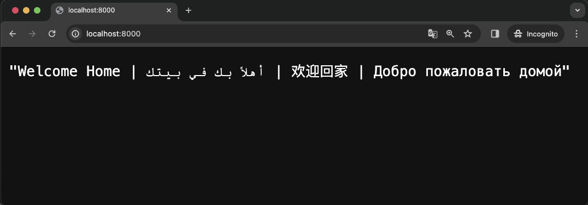
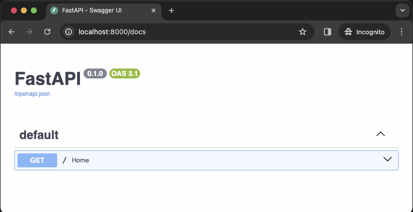
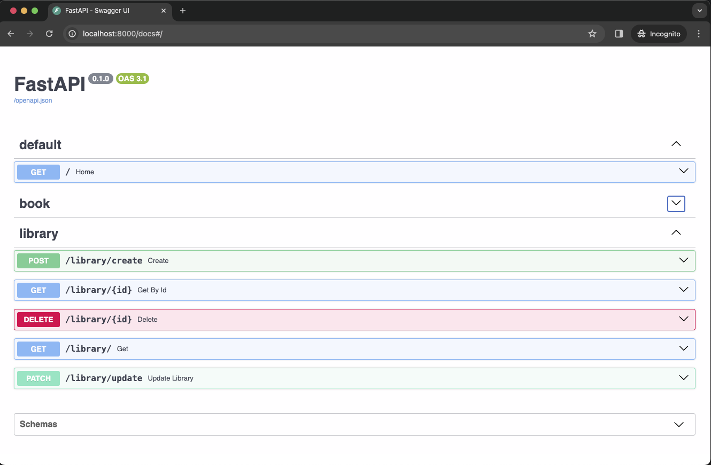

# Python restapi postgresql using FastAPI and virtual environments

## &#x1F6A9; Docker container and postgresql

- create postgresql container.

        ❯ docker run -d \
        --name postgres-container \
        -e POSTGRES_USER=postgres \
        -e POSTGRES_PASSWORD=postgres \
        -p 5432:5432 \
        -v /Users/powercommerce/Documents/test/docker-mount/postgres:/var/lib/postgresql/data \
        postgres:16.1

- list images and containers

        ❯ docker images

            REPOSITORY   TAG       IMAGE ID       CREATED        SIZE
            postgres     16.1      488c2842403b   2 months ago   448MB

        ❯ docker ps -a --format "table {{.ID}}\t{{.Image}}\t{{.Status}}\t{{.Names}}\t{{.Ports}}"

            CONTAINER ID   IMAGE           STATUS         NAMES                PORTS
            c4dc90b5c528   postgres:16.1   Up 6 seconds   postgres-container   0.0.0.0:5432->5432/tcp            
            

- check IP 

        ❯ ifconfig | grep broadcast

            inet 192.168.100.225 netmask 0xffffff00 broadcast 192.168.100.255

- test connection to postgresql

        ❯ psql -h <SESUAIKAN-HOST-IP> -U postgres

            Password for user postgres: 
            psql (16.1 (Homebrew))
            Type "help" for help.

            postgres=#

- config database and stucture

    - create database.

            postgres=# CREATE DATABASE python_db;
            CREATE DATABASE

    - show databases.

            postgres=# select datname from pg_database where datname = 'python_db';
            datname  
            -----------
            python_db
            (1 row)

    - enter into db.

            postgres=# \c python_db 
            You are now connected to database "python_db" as user "postgres".    

    - create table

            python_db=# CREATE TABLE book(
            python_db(# id serial primary key,
            python_db(# title text not null,
            python_db(# description char(200)
            python_db(# );
            CREATE TABLE
            python_db=# \d
                        List of relations
            Schema |    Name     |   Type   |  Owner   
            --------+-------------+----------+----------
            public | book        | table    | postgres
            public | book_id_seq | sequence | postgres
            (2 rows)

            python_db=# CREATE TABLE library(
            python_db(# id serial primary key,
            python_db(# name text not null,
            python_db(# country text
            python_db(# );
            CREATE TABLE
            python_db=# \d
                        List of relations
            Schema |      Name      |   Type   |  Owner   
            --------+----------------+----------+----------
            public | book           | table    | postgres
            public | book_id_seq    | sequence | postgres
            public | library        | table    | postgres
            public | library_id_seq | sequence | postgres
            (4 rows)

    - quit.

            postgres=# \q
---

## &#x1F6A9; Code restapi with FastAPI

create virtual environments

    ❯ python -m venv venv

ally in the local virtual environments.

    ❯ source venv/bin/activate

install some necessary packages (test with another version of fastapi) --> SUCCESSFUL | &#x2705; RECOMMANDED VERSION

    ❯ pip install uvicorn==0.27.1 fastapi==0.99.1    

        notes : [fastapi] There is a lack of support for newer versions of fastapi, 
        so it is recommended to use this version or a level not further below it.

    ❯ pip install SQLAlchemy==2.0.28

    ❯ pip install psycopg2==2.9.9

    ❯ pip install flask==3.0.2

---

&#x1FAA7; notes : 

    ❯ pip list

        Package           Version
        ----------------- -------
        anyio             4.3.0
        blinker           1.7.0
        click             8.1.7
        exceptiongroup    1.2.0
        fastapi           0.99.1
        Flask             3.0.2
        h11               0.14.0
        idna              3.6
        itsdangerous      2.1.2
        Jinja2            3.1.3
        MarkupSafe        2.1.5
        pip               22.0.4
        psycopg2          2.9.9
        pydantic          1.10.14
        setuptools        58.1.0
        sniffio           1.3.1
        SQLAlchemy        2.0.28
        starlette         0.27.0
        typing_extensions 4.10.0
        uvicorn           0.27.1
        Werkzeug          3.0.1

build a project folder and its files.

    ❯ cd 1-fastapi-postgresql

    ❯ mkdir -p app

    ❯ cd app

    ❯ touch main.py config.py model.py schemas.py crud.py router.py 

    ❯ tree ./

        ├── config.py
        ├── crud.py
        ├── main.py
        ├── model.py
        ├── router.py
        └── schemas.py

#### &#x1F530; Code main.py : 

Basic project.

        from fastapi import FastAPI

        app=FastAPI()

        @app.get('/')
        async def Home():
            return "Welcome Home"

#### &#x1F3C4; Run project

        ❯ uvicorn main:app --reload

            INFO:     Will watch for changes in these directories: ['/Users/.../python-restAPI-postgresql-using-FastAPI-and-virtualenv/1-fastapi-postgresql/app']
            INFO:     Uvicorn running on http://127.0.0.1:8000 (Press CTRL+C to quit)
            INFO:     Started reloader process [98301] using StatReload
            INFO:     Started server process [98303]
            INFO:     Waiting for application startup.
            INFO:     Application startup complete.            

    

Main | Browser http://localhost:8000

- &#x1F537; Documentation [Swagger API]

    

Swagger | Browser http://localhost:8000/docs

---

&#x1F6A7; continue with the next code development.

## &#x1FA90; DATA : BOOK AND LIBRARY

#### &#x1F530; Code main.py :

#### &#x1F530; Code config.py :

#### &#x1F530; Code model.py :

    
        

#### &#x1F530; Code schemas.py :

#### &#x1F530; Code crud.py :

#### &#x1F530; Code routes.py :

    
    

---

#### &#x1F3C4; Run project

Here are the results of running the project if using the latest version or from a non-recommended version of fastapi

        ❯ uvicorn main:app --reload

            INFO:     Will watch for changes in these directories: ['/Users/.../python-restAPI-postgresql-using-FastAPI-and-virtual-environments/1-fastapi-postgresql/app']
            INFO:     Uvicorn running on http://127.0.0.1:8000 (Press CTRL+C to quit)
            INFO:     Started reloader process [14386] using StatReload
            /Users/.../python-restAPI-postgresql-using-FastAPI-and-virtual-environments/venv/lib/python3.10/site-packages/pydantic/_migration.py:283: UserWarning: `pydantic.generics:GenericModel` has been moved to `pydantic.BaseModel`.
            warnings.warn(f'`{import_path}` has been moved to `{new_location}`.')
            /Users/.../python-restAPI-postgresql-using-FastAPI-and-virtual-environments/venv/lib/python3.10/site-packages/pydantic/_internal/_config.py:322: UserWarning: Valid config keys have changed in V2:
            * 'orm_mode' has been renamed to 'from_attributes'
            warnings.warn(message, UserWarning)
            INFO:     Started server process [14388]
            INFO:     Waiting for application startup.
            INFO:     Application startup complete.

---

Here are the results of running the project if using the recommended version of fastapi &#x2705; .

        ❯ uvicorn main:app --reload

            INFO:     Will watch for changes in these directories: ['/Users/.../python-restAPI-postgresql-using-FastAPI-and-virtual-environments/1-fastapi-postgresql/app']
            INFO:     Uvicorn running on http://127.0.0.1:8000 (Press CTRL+C to quit)
            INFO:     Started reloader process [95230] using StatReload
            INFO:     Started server process [95232]
            INFO:     Waiting for application startup.
            INFO:     Application startup complete.

&#x1FAA7; notes :

If you encounter the following error while running the project, deactivate the virtual environment and access the venv/bin/activate source again.

    . . .
    ModuleNotFoundError: No module named 'sqlalchemy'

---

## RESULT :

### &#x1F31F; CURL : 

- &#x1F536; library [create library]

    

- &#x1F536; library [get all library]

    

- &#x1F536; library [get by id library]

    

- &#x1F536; library [update library]

    

- &#x1F536; library [delete library]

    

---

- &#x1F537; Documentation [Swagger API]

    

---